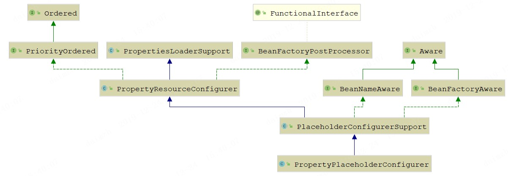
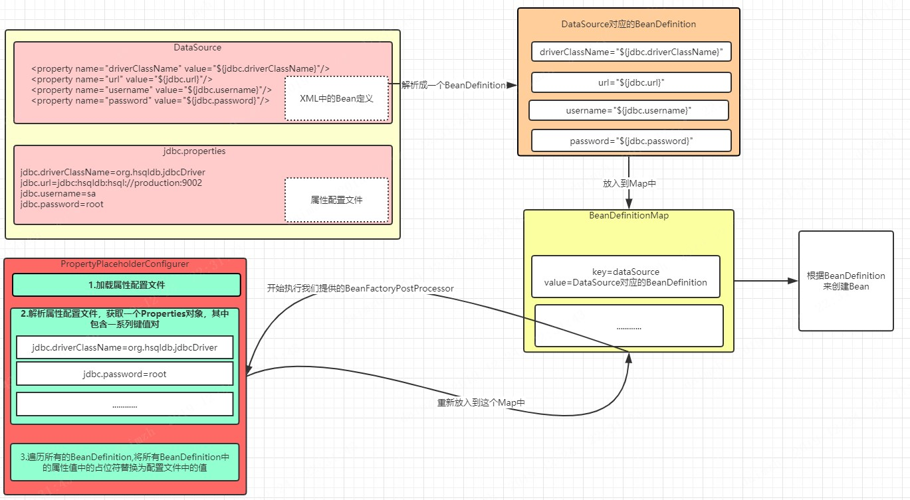

Spring官网阅读（六）容器的扩展点（一）BeanFactoryPostProcessor

> 之前的文章我们已经学习完了`BeanDefinition`的基本概念跟合并，其中多次提到了容器的扩展点，这篇文章我们就开始学习这方面的知识。这部分内容主要涉及官网中的`1.8`小结。按照官网介绍来说，容器的扩展点可以分类三类，`BeanPostProcessor`,`BeanFactoryPostProcessor`以及`FactoryBean`。本文我们主要学习`BeanFactoryPostProcessor`，对应官网中内容为`1.8.2`小节

#### 总览：

先看看官网是怎么说的：


从上面这段话，我们可以总结如下几点：

1. `BeanFactoryPostProcessor`可以对Bean配置元数据进行操作。也就是说，Spring容器允许`BeanFactoryPostProcessor`读取指定Bean的配置元数据，并可以在Bean被实例化之前修改它。这里说的配置元数据其实就是我们之前讲过的`BeanDefinition`。
2. 我们可以配置多个`BeanFactoryPostProcessor`，并且只要我们配置的`BeanFactoryPostProcessor`同时实现了`Ordered`接口的话，我们还可以控制这些`BeanFactoryPostProcessor`执行的顺序

接下来，我们通过Demo来感受下`BeanFactoryPostProcessor`的作用：

#### 例子：

这里就以官网上的demo为例：

```xml
<bean class="org.springframework.beans.factory.config.PropertyPlaceholderConfigurer">
    <property name="locations" value="classpath:com/something/jdbc.properties"/>
</bean>

<bean id="dataSource" destroy-method="close"
        class="org.apache.commons.dbcp.BasicDataSource">
    <property name="driverClassName" value="${jdbc.driverClassName}"/>
    <property name="url" value="${jdbc.url}"/>
    <property name="username" value="${jdbc.username}"/>
    <property name="password" value="${jdbc.password}"/>
</bean>
```

```properties
# jdbc.properties
jdbc.driverClassName=org.hsqldb.jdbcDriver
jdbc.url=jdbc:hsqldb:hsql://production:9002
jdbc.username=sa
jdbc.password=root
```

在上面的例子中，我们配置了一个`PropertyPlaceholderConfigurer`,为了方便理解，我们先分析下这个类，其`UML`类图如下：



- `Ordered`用于决定执行顺序
- `PriorityOrdered`，这个接口直接继承了`Ordered`接口，并且没有做任何扩展。只是作为一个标记接口，也用于决定`BeanFactoryPostProcessor`的执行顺序。在后文源码分析时，我们会看到他的作用
- `Aware`相关的接口我们在介绍Bean的生命周期回调时统一再分析，这里暂且不管
- `FunctionalInterface`,这是`java8`新增的一个接口，也只是起一个标记作用，标记该接口是一个函数式接口。

- `BeanFactoryPostProcessor`，代表这个类是一个Bean工厂的后置处理器。
- `PropertiesLoaderSupport`,这个类主要包含定义了属性的加载方法，包含的属性如下：

```java
// 本地属性，可以直接在XML中配置
@Nullable
protected Properties[] localProperties;

// 是否用本地的属性覆盖提供的文件中的属性，默认不会
protected boolean localOverride = false;

// 根据地址找到的对应文件
@Nullable
private Resource[] locations;

// 没有找到对应文件是否抛出异常，false代表不抛出
private boolean ignoreResourceNotFound = false;

// 对应文件资源的编码
@Nullable
private String fileEncoding;

// 文件解析器
private PropertiesPersister propertiesPersister = new DefaultPropertiesPersister();
```

- `PropertyResourceConfigurer`，这个类主要可以对读取到的属性进行一些转换
- `PlaceholderConfigurerSupport`，主要负责对占位符进行解析。其中几个属性如下：

```java
// 默认解析的前缀
public static final String DEFAULT_PLACEHOLDER_PREFIX = "${";
// 默认解析的后缀
public static final String DEFAULT_PLACEHOLDER_SUFFIX = "}";
// 属性名称跟属性值的分隔符
public static final String DEFAULT_VALUE_SEPARATOR = ":";
```

- `PropertyPlaceholderConfigurer`继承了上面这些类的所有功能，同时可以配置属性的解析顺序

```java
// 不在系统属性中查找
public static final int SYSTEM_PROPERTIES_MODE_NEVER = 0;

// 如果在配置文件中没有找到，再去系统属性中查找
public static final int SYSTEM_PROPERTIES_MODE_FALLBACK = 1;

// 先查找系统属性，没查到再去查找配置文件中的属性
public static final int SYSTEM_PROPERTIES_MODE_OVERRIDE = 2;
```

对这个类有一些了解之后，我们回到之前的例子中，为什么在`jdbc.properties`文件中配置的属性值会被应用到

`BasicDataSource`这个Bean上呢？为了帮助大家理解，我画了一个图：



这个流程就如上图，可以看到我们通过`PropertyPlaceholderConfigurer`这个特殊的`BeanFactoryPostProcessor`完成了`BeanDefinition`中的属性值中的占位符的替换。在`BeanDefinition`被解析出来后，Bean实例化之前对其进行了更改了。

在上图中，创建Bean的过程我们暂且不管，还有一个问题我们需要弄清楚，Spring是如何扫描并解析成`BeanDefinition`的呢？这里就不得不提到我们接下来需要分析的这个接口了:``BeanDefinitionRegistryPostProcessor`。

#### `BeanDefinitionRegistryPostProcessor（重要）`：

我们先来看一下这个接口的`UML`类图：


从上图中，我们可以得出两个结论：

1. `BeanDefinitionRegistryPostProcessor`直接继承了`BeanFactoryPostProcessor`，所以它也是一个Bean工厂的后置处理器
2. Spring只提供了一个内置的`BeanDefinitionRegistryPostProcessor`的实现类，这个类就是`ConfigurationClassPostProcessor`，实际上我们上面说的扫描解析成`BeanDefinition`的过程就是由这个类完成的

我们来看下这个接口定义：

```java
public interface BeanDefinitionRegistryPostProcessor extends BeanFactoryPostProcessor {
	void postProcessBeanDefinitionRegistry(BeanDefinitionRegistry registry) throws BeansException;

}

public interface BeanFactoryPostProcessor {
	void postProcessBeanFactory(ConfigurableListableBeanFactory beanFactory) throws BeansException;

}
```

相比于正常的`BeanFactoryPostProcessor`，`BeanDefinitionRegistryPostProcessor`多提供了一个方法，那么多提供的这个方法有什么用呢？这个方法会在什么时候执行呢？这里我先说结论：

> 这个方法的左右也是为了扩展，相比于`BeanFactoryPostProcessor`的`postProcessBeanFactory`方法，这个方法的执行时机会更加靠前，Spring自身利用这个特性完成了`BeanDefinition`的扫描解析。我们在对Spring进行扩展时，也可以利用这个特性来完成扫描这种功能，比如最新版的`Mybatis`就是这么做的。关于`Mybatis`跟Spring整合的过程，我打算在写完Spring的扫描以及容器的扩展点这一系列文章后单独用一篇文章来进行分析。

接下来，我们直接分析其源码，验证上面的结论。

#### 执行流程源码解析：

在分析源码前，我们看看下面这个图，以便大家对Spring的执行流程有个大概的了解：


上图表示的是形如`AnnotationConfigApplicationContext ac = new AnnotationConfigApplicationContext(Config.class)`的执行流程。我们这次分析的代码主要是其中的`3-5-1`流程。对于的代码如下（代码比较长，我们拆分成两部分分析）：

##### `BeanDefinitionRegistryPostProcessor`执行流程

```java
public static void invokeBeanFactoryPostProcessors(ConfigurableListableBeanFactory beanFactory, List<BeanFactoryPostProcessor> beanFactoryPostProcessors) {
    Set<String> processedBeans = new HashSet<>();
    // 这个if基本上一定会成立，除非我们手动new了一个beanFactory
    if (beanFactory instanceof BeanDefinitionRegistry) {
        
        BeanDefinitionRegistry registry = (BeanDefinitionRegistry) beanFactory;
       
        // 存储了只实现了BeanFactoryPostProcessor接口的后置处理器
        List<BeanFactoryPostProcessor> regularPostProcessors = new ArrayList<>();
        
        // 存储了实现了BeanDefinitionRegistryPostProcessor接口的后置处理器
        List<BeanDefinitionRegistryPostProcessor> registryProcessors = new ArrayList<>();
		
        // 这个beanFactoryPostProcessors集合一般情况下都是空的，除非我们手动调用容器的addBeanFactoryPostProcessor方法
        for (BeanFactoryPostProcessor postProcessor : beanFactoryPostProcessors) {
            if (postProcessor instanceof BeanDefinitionRegistryPostProcessor) {
                BeanDefinitionRegistryPostProcessor registryProcessor = (BeanDefinitionRegistryPostProcessor) postProcessor;
               
                // 执行实现了BeanDefinitionRegistryPostProcessor接口的后置处理器的postProcessBeanDefinitionRegistry方法，注意这里执行的不是postProcessBeanFactory方法，我们上面已经讲过了，实现了BeanDefinitionRegistryPostProcessor接口的后置处理器有两个方法，一个是从父接口中继承而来的postProcessBeanFactory方法，另一个是这个接口特有的postProcessBeanDefinitionRegistry方法
                registryProcessor.postProcessBeanDefinitionRegistry(registry);
               
                // 保存执行过了的BeanDefinitionRegistryPostProcessor，这里执行过的BeanDefinitionRegistryPostProcessor只是代表它的特有方法：postProcessBeanDefinitionRegistry方法执行过了，但是千万记得，它还有一个标准的postProcessBeanFactory，也就是从父接口中继承的方法还未执行
                registryProcessors.add(registryProcessor);
           
            } else {
               
                // 将只实现了BeanFactoryPostProcessor接口的后置处理器加入到集合中
                regularPostProcessors.add(postProcessor);
            }
        }
		// 保存当前需要执行的实现了BeanDefinitionRegistryPostProcessor接口的后置处理器
        List<BeanDefinitionRegistryPostProcessor> currentRegistryProcessors = new ArrayList<>();
		// 从容器中获取到所有实现了BeanDefinitionRegistryPostProcessor接口的Bean的名字
        String[] postProcessorNames = beanFactory.getBeanNamesForType(BeanDefinitionRegistryPostProcessor.class, true, false);
        for (String ppName : postProcessorNames) {
            // 判断这个类是否还实现了PriorityOrdered接口
            if (beanFactory.isTypeMatch(ppName, PriorityOrdered.class)) {
                // 如果满足条件，会将其创建出来，同时添加到集合中
                // 正常情况下，只会有一个，就是Spring容器自己提供的ConfigurationClassPostProcessor,Spring通过这个类完成了扫描以及BeanDefinition的功能
                currentRegistryProcessors.add(beanFactory.getBean(ppName, BeanDefinitionRegistryPostProcessor.class));
                processedBeans.add(ppName);
            }
        }
        // 根据实现的PriorityOrdered接口进行拍讯
        sortPostProcessors(currentRegistryProcessors, beanFactory);
		
        // 将当前将要执行的currentRegistryProcessors全部添加到registryProcessors这个集合中
        registryProcessors.addAll(currentRegistryProcessors);
        
        // 执行后置处理器的逻辑，这里只会执行BeanDefinitionRegistryPostProcessor接口的postProcessBeanDefinitionRegistry方法
        invokeBeanDefinitionRegistryPostProcessors(currentRegistryProcessors, registry);
        
        // 清空集合
        currentRegistryProcessors.clear();
		
        // 这里重新获取实现了BeanDefinitionRegistryPostProcesso接口的后置处理器的名字，思考一个问题：为什么之前获取了一次不能直接用呢？还需要获取一次呢？这是因为，在我们上面执行过了BeanDefinitionRegistryPostProcessor中，可以在某个类中，我们扩展的时候又注册了一个实现了BeanDefinitionRegistryPostProcessor接口的后置处理器
        postProcessorNames = beanFactory.getBeanNamesForType(BeanDefinitionRegistryPostProcessor.class, true, false);
        for (String ppName : postProcessorNames) {
            // 确保没有被处理过并且实现了Ordered接口
            if (!processedBeans.contains(ppName) && beanFactory.isTypeMatch(ppName, Ordered.class)) {
                // 加入到当前需要被执行的集合中
                currentRegistryProcessors.add(beanFactory.getBean(ppName, BeanDefinitionRegistryPostProcessor.class));
                processedBeans.add(ppName);
            }
        }
       
        // 根据ordered接口进行排序
        sortPostProcessors(currentRegistryProcessors, beanFactory);
       
        // 将当前将要执行的currentRegistryProcessors全部添加到registryProcessors这个集合中
        registryProcessors.addAll(currentRegistryProcessors);
       
        // 执行后置处理器的逻辑，这里只会执行BeanDefinitionRegistryPostProcessor接口的postProcessBeanDefinitionRegistry方法
        invokeBeanDefinitionRegistryPostProcessors(currentRegistryProcessors, registry);
        
        // 清空集合
        currentRegistryProcessors.clear();
		
        // 接下来这段代码是为了确认所有实现了BeanDefinitionRegistryPostProcessor的后置处理器能够执行完，之所有要一个循环中执行，也是为了防止在执行过程中注册了新的BeanDefinitionRegistryPostProcessor
        boolean reiterate = true;
        while (reiterate) {
            reiterate = false;
            // 获取普通的BeanDefinitionRegistryPostProcessor，不需要实现PriorityOrdered或者Ordered接口
            postProcessorNames = beanFactory.getBeanNamesForType(BeanDefinitionRegistryPostProcessor.class, true, false);
            for (String ppName : postProcessorNames) {
                if (!processedBeans.contains(ppName)) {
                    // 只要发现有一个需要执行了的后置处理器，就需要再次循环，因为执行了这个后置处理可能会注册新的BeanDefinitionRegistryPostProcessor
                    currentRegistryProcessors.add(beanFactory.getBean(ppName, BeanDefinitionRegistryPostProcessor.class));
                    processedBeans.add(ppName);
                    reiterate = true;
                }
            }
            sortPostProcessors(currentRegistryProcessors, beanFactory);
            registryProcessors.addAll(currentRegistryProcessors);
            invokeBeanDefinitionRegistryPostProcessors(currentRegistryProcessors, registry);
            currentRegistryProcessors.clear();
        }
    ......
```

##### `BeanFactoryPostProcessor`执行流程：

```java
	......承接上半部分代码......

        // 这里开始执行单独实现了BeanFactoryPostProcessor接口的后置处理器
        // 1.先执行实现了BeanDefinitionRegistryPostProcessor的BeanFactoryPostProcessor，在前面的逻辑中我们只执行了BeanDefinitionRegistryPostProcessor特有的postProcessBeanDefinitionRegistry方法，它的postProcessBeanFactory方法还没有被执行，它会在这里被执行
        invokeBeanFactoryPostProcessors(registryProcessors, beanFactory);
        // 2.执行直接实现了BeanFactoryPostProcessor接口的后置处理器
        invokeBeanFactoryPostProcessors(regularPostProcessors, beanFactory);
    } else {
		// 正常情况下，进不来这个判断，不用考虑
        invokeBeanFactoryPostProcessors(beanFactoryPostProcessors, beanFactory);
    }
		// 获取所有实现了BeanFactoryPostProcessor接口的后置处理器，这里会获取到已经执行过的后置处理器，所以后面的代码会区分已经执行过或者未执行过
		String[] postProcessorNames = beanFactory.getBeanNamesForType(BeanFactoryPostProcessor.class, true, false);

		// 保存直接实现了BeanFactoryPostProcessor接口和PriorityOrdered接口的后置处理器
		List<BeanFactoryPostProcessor> priorityOrderedPostProcessors = new ArrayList<>();

		// 保存直接实现了BeanFactoryPostProcessor接口和Ordered接口的后置处理器
		List<String> orderedPostProcessorNames = new ArrayList<>();

		// 保存直接实现了BeanFactoryPostProcessor接口的后置处理器，不包括那些实现了排序接口的类
		List<String> nonOrderedPostProcessorNames = new ArrayList<>();
		for (String ppName : postProcessorNames) {
			if (processedBeans.contains(ppName)) {
                // 已经处理过了，直接跳过
			} else if (beanFactory.isTypeMatch(ppName, PriorityOrdered.class)) {
                // 符合条件，加入到之前申明的集合
				priorityOrderedPostProcessors.add(beanFactory.getBean(ppName, BeanFactoryPostProcessor.class));
			} else if (beanFactory.isTypeMatch(ppName, Ordered.class)) {
				orderedPostProcessorNames.add(ppName);
			} else {
				nonOrderedPostProcessorNames.add(ppName);
			}
		}

		// 先执行实现了BeanFactoryPostProcessor接口和PriorityOrdered接口的后置处理器
		sortPostProcessors(priorityOrderedPostProcessors, beanFactory);
		invokeBeanFactoryPostProcessors(priorityOrderedPostProcessors, beanFactory);

		// 再执行实现了BeanFactoryPostProcessor接口和Ordered接口的后置处理器
		List<BeanFactoryPostProcessor> orderedPostProcessors = new ArrayList<>();
		for (String postProcessorName : orderedPostProcessorNames) {
			orderedPostProcessors.add(beanFactory.getBean(postProcessorName, BeanFactoryPostProcessor.class));
		}
		sortPostProcessors(orderedPostProcessors, beanFactory);
		invokeBeanFactoryPostProcessors(orderedPostProcessors, beanFactory);

		// 最后执行BeanFactoryPostProcessor接口的后置处理器，不包括那些实现了排序接口的类
		List<`1> nonOrderedPostProcessors = new ArrayList<>();
		for (String postProcessorName : nonOrderedPostProcessorNames) {
			nonOrderedPostProcessors.add(beanFactory.getBean(postProcessorName, BeanFactoryPostProcessor.class));
		}
		invokeBeanFactoryPostProcessors(nonOrderedPostProcessors, beanFactory);

		// 将合并的BeanDefinition清空，这是因为我们在执行后置处理器时，可能已经修改过了BeanDefinition中的属性，所以需要清空，以便于重新合并
		beanFactory.clearMetadataCache();
```

通过源码分析，我们可以将整个Bean工厂的后置处理器的执行流程总结如下：


首先，要明白一点，上图分为左右两个部分，代表的不是两个接口，而是两个方法

- 一个是`BeanDefinitionRegistryPostProcesso`r特有的`postProcessBeanDefinitionRegistry`方法
- 另外一个是`BeanFactoryPostProcessor`的`postProcessBeanFactory`方法

这里我们以方法为维度区分更好说明问题，`postProcessBeanDefinitionRegistry`方法的执行时机早于`postProcessBeanFactory`。并且他们按照上图从左到右的顺序进行执行。

另外在上面进行代码分析的时候不知道大家有没有发现一个问题，当在执行`postProcessBeanDefinitionRegistry`方法时，Spring采用了循环的方式，不断的查找是否有新增的`BeanDefinitionRegistryPostProcessor`，就是下面这段代码：

```java
boolean reiterate = true;
			while (reiterate) {
				reiterate = false;
				postProcessorNames = beanFactory.getBeanNamesForType(BeanDefinitionRegistryPostProcessor.class, true, false);
				for (String ppName : postProcessorNames) {
					if (!processedBeans.contains(ppName)) {
						currentRegistryProcessors.add(beanFactory.getBean(ppName, BeanDefinitionRegistryPostProcessor.class));
						processedBeans.add(ppName);
						reiterate = true;
					}
				}
				sortPostProcessors(currentRegistryProcessors, beanFactory);
				registryProcessors.addAll(currentRegistryProcessors);
				invokeBeanDefinitionRegistryPostProcessors(currentRegistryProcessors, registry);
				currentRegistryProcessors.clear();
			}

```

但是在执行`postProcessBeanFactory`并没有进行类似的查找。这是为什么呢？

笔者自己认为主要是设计使然，Spring在设计时`postProcessBeanFactory`这个方法不是用于重新注册一个Bean的，而是修改。我们可以看下这个方法上的这段`java doc`

```java
	/**
	 * Modify the application context's internal bean factory after its standard
	 * initialization. All bean definitions will have been loaded, but no beans
	 * will have been instantiated yet. This allows for overriding or adding
	 * properties even to eager-initializing beans.
	 * @param beanFactory the bean factory used by the application context
	 * @throws org.springframework.beans.BeansException in case of errors
	 */
	void postProcessBeanFactory(ConfigurableListableBeanFactory beanFactory) throws BeansException;
```

其中最重要的一段话：`All bean definitions will have been loaded`，所有的`beanDefinition`都已经被加载了。

我们再对比下`postProcessBeanDefinitionRegistry`这个方法上的`java doc`

```java
	/**
	 * Modify the application context's internal bean definition registry after its
	 * standard initialization. All regular bean definitions will have been loaded,
	 * but no beans will have been instantiated yet. This allows for adding further
	 * bean definitions before the next post-processing phase kicks in.
	 * @param registry the bean definition registry used by the application context
	 * @throws org.springframework.beans.BeansException in case of errors
	 */
	void postProcessBeanDefinitionRegistry(BeanDefinitionRegistry registry) throws BeansException;
```

大家注意这段话，` This allows for adding further bean definitions before the next post-processing phase kicks in.`允许我们在下一个后置处理器执行前添加更多的`BeanDefinition`

从这里，我相信大家更加能理解为什么`postProcessBeanDefinitionRegistry`这个方法的执行时机要早于`postProcessBeanFactory`了。

#### 使用过程中的几个问题：

##### 1、可不可以在`BeanFactoryPostProcessor`去创建一个Bean，这样有什么问题？

从技术上来说这样是可以的，但是正常情况下我们不该这样做，这是因为可能会存在该执行的Bean工厂的后置处理器的逻辑没有被应用到这个Bean上。

##### 2、`BeanFactoryPostProcessor`可以被配置为懒加载吗？

不能配置为懒加载，即使配置了也不会生效。我们将Bean工厂后置处理器配置为懒加载这个行为就没有任何意义

#### 总结：

在这篇文章中，我们最需要了解及掌握的就是`BeanFactoryPostProcessor`执行的顺序，总结如下：

- 先执行直接实现了`BeanDefinitionRegistryPostProcesso`r接口的后置处理器，所有实现了`BeanDefinitionRegistryPostProcesso`r接口的类有两个方法，一个是特有的`postProcessBeanDefinitionRegistry`方法，一个是继承子父接口的`postProcessBeanFactory`方法。

  - `postProcessBeanDefinitionRegistry`方法早于`postProcessBeanFactory`方法执行，对于`postProcessBeanDefinitionRegistry`的执行顺序又遵循如下原子
    1. 先执行实现了`PriorityOrdered`接口的类中的`postProcessBeanDefinitionRegistry`方法
    2. 再执行实现了`Ordered`接口的类中的`postProcessBeanDefinitionRegistry`的方法
    3. 最后执行没有实现上面两个接口的类中的`postProcessBeanDefinitionRegistry`的方法

  - 执行完所有的`postProcessBeanDefinitionRegistry`方法后，再执行实现了`BeanDefinitionRegistryPostProcesso`r接口的类中的`postProcessBeanFactory`方法

- 再执行直接实现了`BeanFactoryPostProcessor`接口的后置处理器

  1. 先执行实现了`PriorityOrdered`接口的类中的`postProcessBeanFactory`方法

  2. 再执行实现了`Ordered`接口的类中的`postProcessBeanFactory`的方法

  3. 最后执行没有实现上面两个接口的类中的`postProcessBeanFactory`的方法


