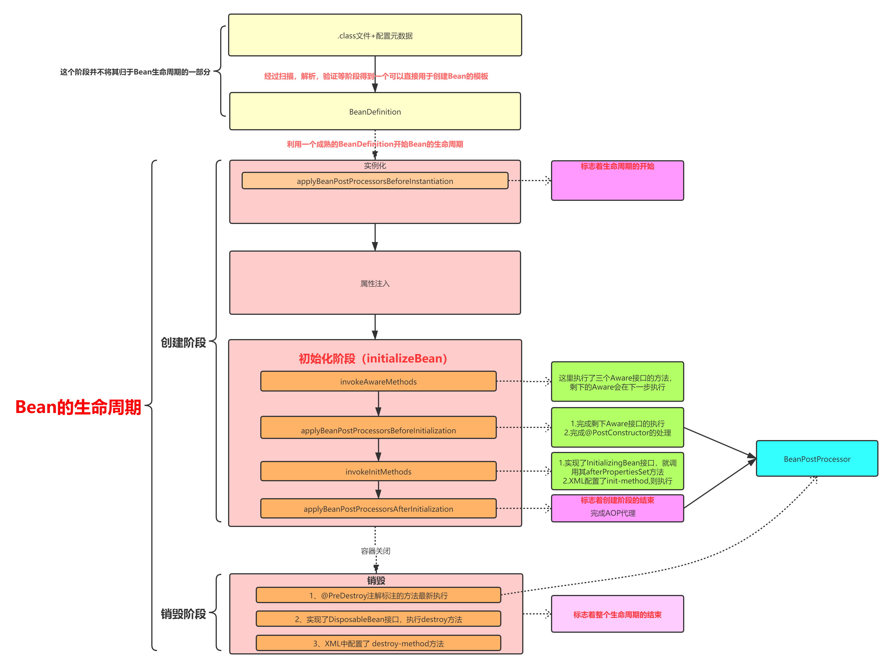
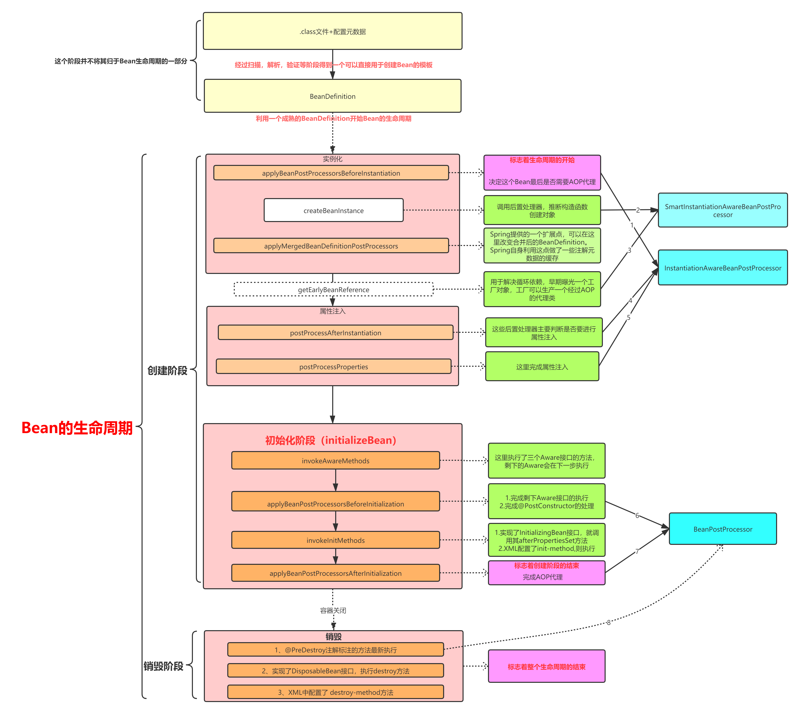

Spring官网阅读（十）Spring中Bean的生命周期（下）

> 在上篇文章中，我们已经对Bean的生命周期做了简单的介绍，主要介绍了整个生命周期中的初始化阶段以及基于容器启动停止时`LifeCycleBean`的回调机制，另外对Bean的销毁过程也做了简单介绍。但是对于整个Bean的生命周期，这还只是一小部分，在这篇文章中，我们将学习完成剩下部分的学习，同时对之前的内容做一次复习。整个Bean的生命周期，按照我们之前的介绍，可以分为四部分
>
> - 实例化
> - 属性注入
> - 初始化
> - 销毁
>
> 本文主要介绍实例化及属性注入阶段

### 生命周期概念补充

虽然我们一直说整个Bean的生命周期分为四个部分，但是相信很多同学一直对Bean的生命周期到底从哪里开始，到哪里结束没有一个清晰的概念。可能你会说，不就是从**实例化**开始，到**销毁**结束吗？当然，这并没有错，但是具体什么时候算开始实例化呢？什么时候又算销毁呢？这个问题你是否能清楚的回答呢？如果不能，请继续往下看。

笔者认为，整个Spring中Bean的生命周期，**从第一次调用后置处理器中的`applyBeanPostProcessorsBeforeInstantiation`方法开始的**，这个方法见名知意，翻译过来就是**在实例化之前调用后置处理器**。**而`applyBeanPostProcessorsAfterInitialization`方法的调用，意味着Bean的生命周期中创建阶段的结束**。对于销毁没有什么歧义，就是在调用对应Bean的销毁方法就以为着这个Bean走到了生命的尽头，标志着Bean生命周期的结束。那么结合上篇文章中的结论，我现在把Bean的生命周期的范围界定如下：




需要注意的是，对于`BeanDefinion`的扫描，解析，验证并不属于Bean的生命周期的一部分。这样清晰的界定Bean的生命周期的概念是很有必要的，也许刚刚开始对于我们而言，Bean的生命周期就是一团乱麻，但是至少现在我们已经抓住了**线头**。而整个Bean的生命周期，我将其分为了两部分

- 创建
- 销毁

对于销毁阶段，我们不需要过多关注，对于创建阶段，开始的标志行为为：`applyBeanPostProcessorsBeforeInstantiation`方法执行，结束的标志行为为：`applyBeanPostProcessorsAfterInitialization`方法执行。

基于上面的结论，我们开始进行接下来的分析对于本文中代码的分析，我们还是参照下面这个图


### 实例化

整个实例化的过程主要对于上图中的`3-11-6-4`（`createBean`）以及`3-11-6-4-1`（`doCreateBean`）步骤

#### createBean流程分析

代码如下：

```java
protected Object createBean(String beanName, RootBeanDefinition mbd, @Nullable Object[] args)
			throws BeanCreationException {

		RootBeanDefinition mbdToUse = mbd;
		
    // 第一步：解析BeanDefinition中的beanClass属性
		Class<?> resolvedClass = resolveBeanClass(mbd, beanName);
		if (resolvedClass != null && !mbd.hasBeanClass() && mbd.getBeanClassName() != null) {
			mbdToUse = new RootBeanDefinition(mbd);
			mbdToUse.setBeanClass(resolvedClass);
		}
    
		try {
            // 第二步：处理lookup-method跟replace-method，判断是否存在方法的重载
			mbdToUse.prepareMethodOverrides();
		}
		catch (BeanDefinitionValidationException ex) {
			throw new BeanDefinitionStoreException(mbdToUse.getResourceDescription(),
					beanName, "Validation of method overrides failed", ex);
		}

		try {
			// 第三步：判断这个类在之后是否需要进行AOP代理
			Object bean = resolveBeforeInstantiation(beanName, mbdToUse);
			if (bean != null) {
				return bean;
			}
		}
		catch (Throwable ex) {
			throw new BeanCreationException(mbdToUse.getResourceDescription(), beanName,
					"BeanPostProcessor before instantiation of bean failed", ex);
		}

		try {
            // 开始创建Bean
			Object beanInstance = doCreateBean(beanName, mbdToUse, args);
			return beanInstance;
		}
		catch (BeanCreationException | ImplicitlyAppearedSingletonException ex) {
			throw ex;
		}
		catch (Throwable ex) {
			throw new BeanCreationException(
					mbdToUse.getResourceDescription(), beanName, "Unexpected exception during bean creation", ex);
		}
	}
```

可以看到，`第一步`跟`第二步`还是在对`BeanDefinition`中的一些属性做处理，它并不属于我们Bean的生命周期的一部分，我们直接跳过，接下来看第三步的代码：

```java
protected Object resolveBeforeInstantiation(String beanName, RootBeanDefinition mbd) {
    Object bean = null;
    if (!Boolean.FALSE.equals(mbd.beforeInstantiationResolved)) {
        // 不是合成类，并且有实例化后置处理器。这个判断基本上恒成立
        if (!mbd.isSynthetic() && hasInstantiationAwareBeanPostProcessors()) {
            // 获取这个BeanDefinition的类型
            Class<?> targetType = determineTargetType(beanName, mbd);
            if (targetType != null) {
                // 这里执行的主要是AbstractAutoProxyCreator这个类中的方法，决定是否要进行AOP代理
                bean = applyBeanPostProcessorsBeforeInstantiation(targetType, beanName);
                // 这里执行了一个短路操作，如果在这个后置处理中直接返回了一个Bean,那么后面相关的操作就不会执行了，只会执行一个AOP的代理操作
                if (bean != null) {
                    // 虽然这个Bean被短路了，意味着不需要经过后面的初始化阶段，但是如果需要代理的话，还是要进行AOP代理，这个地方的短路操作只是意味着我们直接在后置处理器中提供了一个准备充分的的Bean，这个Bean不需要进行初始化，但需不需要进行代理，任然由AbstractAutoProxyCreator的applyBeanPostProcessorsBeforeInstantiation方法决定。在这个地方还是要调用一次Bean的初始化后置处理器保证Bean被完全的处理完
                    bean = applyBeanPostProcessorsAfterInitialization(bean, beanName);
                }
            }
        }
        // bean != null基本会一直返回false,所以beforeInstantiationResolved这个变量也会一直为false
        mbd.beforeInstantiationResolved = (bean != null);
    }
    return bean;
}
```

对于`AbstractAutoProxyCreator`中`applyBeanPostProcessorsBeforeInstantiation`这个方法的分析我们暂且不管，等到`AOP`学习阶段在进行详细分析。我们暂且只需要知道**这个方法会决定在后续中要不要为这个Bean产生代理对象**。

#### doCreateBean流程分析

```java
	protected Object doCreateBean(final String beanName, final RootBeanDefinition mbd, final @Nullable Object[] args)
			throws BeanCreationException {

		BeanWrapper instanceWrapper = null;
		if (mbd.isSingleton()) {
            // 第一步：单例情况下，看factoryBeanInstanceCache这个缓存中是否有
			instanceWrapper = this.factoryBeanInstanceCache.remove(beanName);
		}
		if (instanceWrapper == null) {
            // 第二步：这里创建对象
			instanceWrapper = createBeanInstance(beanName, mbd, args);
		}
		final Object bean = instanceWrapper.getWrappedInstance();
		Class<?> beanType = instanceWrapper.getWrappedClass();
		if (beanType != NullBean.class) {
			mbd.resolvedTargetType = beanType;
		}

		synchronized (mbd.postProcessingLock) {
			if (!mbd.postProcessed) {
				try {
                    // 第三步：后置处理器处理
					applyMergedBeanDefinitionPostProcessors(mbd, beanType, beanName);
				}
				catch (Throwable ex) {
					// 省略异常处理
				}
				mbd.postProcessed = true;
			}
		}
		
        // 循环引用相关，源码阅读阶段再来解读这段代码，暂且就关注以下后置处理器的调用时机
		boolean earlySingletonExposure = (mbd.isSingleton() && this.allowCircularReferences &&
				isSingletonCurrentlyInCreation(beanName));
		if (earlySingletonExposure) {
			// 第四步：调用后置处理器，早期曝光一个工厂对象
			addSingletonFactory(beanName, () -> getEarlyBeanReference(beanName, mbd, bean));
		}

		Object exposedObject = bean;
		try {
            // 第五步：属性注入
			populateBean(beanName, mbd, instanceWrapper);
            // 第六步：初始化
			exposedObject = initializeBean(beanName, exposedObject, mbd);
		}
		catch (Throwable ex) {
			if (ex instanceof BeanCreationException && beanName.equals(((BeanCreationException) ex).getBeanName())) {
				throw (BeanCreationException) ex;
			}
			else {
				// 省略异常处理
			}
		}

		if (earlySingletonExposure) {
			Object earlySingletonReference = getSingleton(beanName, false);
			if (earlySingletonReference != null) {
				if (exposedObject == bean) {
					exposedObject = earlySingletonReference;
				}
				else if (!this.allowRawInjectionDespiteWrapping && hasDependentBean(beanName)) {
					String[] dependentBeans = getDependentBeans(beanName);
					Set<String> actualDependentBeans = new LinkedHashSet<>(dependentBeans.length);
					for (String dependentBean : dependentBeans) {
						if (!removeSingletonIfCreatedForTypeCheckOnly(dependentBean)) {
							actualDependentBeans.add(dependentBean);
						}
					}
					if (!actualDependentBeans.isEmpty()) {
						// 省略异常处理
					}
				}
			}
		}

		try {
            // 第七步：注册需要销毁的Bean,放到一个需要销毁的Map中（disposableBeans）
			registerDisposableBeanIfNecessary(beanName, bean, mbd);
		}
		catch (BeanDefinitionValidationException ex) {
			// 省略异常处理
		}

		return exposedObject;
	}
```

##### 第一步：factoryBeanInstanceCache什么时候不为空？

```java
if (mbd.isSingleton()) {
    // 第一步：单例情况下，看factoryBeanInstanceCache这个缓存中是否有
    instanceWrapper = this.factoryBeanInstanceCache.remove(beanName);
}
```

这段代码深究起来很复杂，我这里就单纯用理论解释下：

假设我们现在有一个`IndexService`，它有一个属性A，代码如下：

```java
@Component
public class IndexService {
	@Autowired
	A a;

	public A getA() {
		return a;
	}
}
```

而这个A又是采用`FactroyBean`的形式配置的，如下：

```java
@Component
public class MyFactoryBean implements SmartFactoryBean {
	@Override
	public A getObject() throws Exception {
		return new A();
	}
	@Override
	public Class<?> getObjectType() {
		return A.class;
	}
    // 这个地方并不一定要配置成懒加载，这里只是为了让MyFactoryBean这个Bean在IndexService之后实例化
	@Override
	public boolean isEagerInit() {
		return false;
	}
}
```

我们思考一个问题，在上面这种场景下，当`IndexService`要完成属性注入时，Spring会怎么做呢？

Spring现在知道`IndexService`要注入一个类型为A的属性，所以它会遍历所有的解析出来的`BeanDefinition`，然后每一个`BeanDefinition`中的类型是不是A类型，类似下面这样：

```java
for (String beanName : this.beanDefinitionNames) {
	// 1.获取BeanDefinition
    // 2.根据BeanDefinition中的定义判断是否是一个A
}
```

上面这种判断大部分情况下是成立的，但是对于一种特殊的Bean是不行的，就是我们之前介绍过的`FactoryBean`，因为我们配置`FactoacryBean`的目的并不是直接使用`FactoryBean`这个Bean自身，而是想要通过它的`getObject`方法将一个对象放到Spring容器中，所以当我们遍历到一个`BeanDefinition`，并且这个`BeanDefinition`是一个`FactoacryBean`时就需要做特殊处理，我们知道`FactoacryBean`中有一个`getObjectType`方法，通过这个方法我们可以得到要被这个`FactoacryBean`创建的对象的类型，如果我们能调用这个方法的话，那么我们就可以来判断这个类型是不是一个A了。

但是，在我们上面的例子中，这个时候`MyFactoryBean`还没有被创建出来。所以Spring在这个时候会去实例化这个`MyFactoryBean`，然后调用其`getObjectType`方法，再做类型判断，最后进行属性注入，伪代码如下：

```java
for (String beanName : this.beanDefinitionNames) {
	// 1.获取BeanDefinition
    // 2.如果不是一个FactoacryBean，直接根据BeanDefinition中的属性判断
    if(不是一个FactoacryBean){
        //直接根据BeanDefinition中的属性判断是不是A
    }
    // 3.如果是一个FactoacryBean
    if(是一个FactoacryBean){
        // 先创建这个FactoacryBean，然后再调用getObjectType方法了
    }
}
```

大家可以根据我们上面的代码自己调试，我这里就不放debug的截图了。

##### 第二步：创建对象（createBeanInstance）

```java
protected BeanWrapper createBeanInstance(String beanName, RootBeanDefinition mbd, @Nullable Object[] args) {
		// 获取到解析后的beanClass
		Class<?> beanClass = resolveBeanClass(mbd, beanName);
		
    	// 忽略异常处理
		Supplier<?> instanceSupplier = mbd.getInstanceSupplier();
		if (instanceSupplier != null) {
			return obtainFromSupplier(instanceSupplier, beanName);
		}
		
    	// 获取工厂方法，用于之后创建对象 
		if (mbd.getFactoryMethodName() != null) {
			return instantiateUsingFactoryMethod(beanName, mbd, args);
		}

		// 原型情况下避免多次解析
		boolean resolved = false;
		boolean autowireNecessary = false;
		if (args == null) {
			synchronized (mbd.constructorArgumentLock) {
				if (mbd.resolvedConstructorOrFactoryMethod != null) {
					resolved = true;
					autowireNecessary = mbd.constructorArgumentsResolved;
				}
			}
		}
		if (resolved) {
			if (autowireNecessary) {
				return autowireConstructor(beanName, mbd, null, null);
			}
			else {
				return instantiateBean(beanName, mbd);
			}
		}

		// 跟后置处理器相关，我们主要关注这行代码
		Constructor<?>[] ctors = determineConstructorsFromBeanPostProcessors(beanClass, beanName);
		if (ctors != null || mbd.getResolvedAutowireMode() == AUTOWIRE_CONSTRUCTOR ||
				mbd.hasConstructorArgumentValues() || !ObjectUtils.isEmpty(args)) {
			return autowireConstructor(beanName, mbd, ctors, args);
		}

		// Preferred constructors for default construction?
		ctors = mbd.getPreferredConstructors();
		if (ctors != null) {
			return autowireConstructor(beanName, mbd, ctors, null);
		}

		// 默认使用无参构造函数创建对象
		return instantiateBean(beanName, mbd);
	}
```

在创建对象的时候，其余的代码我们暂时不做过多关注。我们暂且知道在创建对象的过程中，Spring会调用一个后置处理器来推断构造函数。

##### 第三步：applyMergedBeanDefinitionPostProcessors

应用合并后的`BeanDefinition`，Spring自身利用这点做了一些注解元数据的缓存。

我们就以`AutowiredAnnotationBeanPostProcessor`这个类的对应方法看一下其大概作用

```java
public void postProcessMergedBeanDefinition(RootBeanDefinition beanDefinition, Class<?> beanType, String beanName) {
    // 这个方法就是找到这个正在创建的Bean中需要注入的字段，并放入缓存中
    InjectionMetadata metadata = findAutowiringMetadata(beanName, beanType, null);
    metadata.checkConfigMembers(beanDefinition);
}
```

##### 第四步：getEarlyBeanReference

```java
protected Object getEarlyBeanReference(String beanName, RootBeanDefinition mbd, Object bean) {
    Object exposedObject = bean;
    if (!mbd.isSynthetic() && hasInstantiationAwareBeanPostProcessors()) {
        for (BeanPostProcessor bp : getBeanPostProcessors()) {
            if (bp instanceof SmartInstantiationAwareBeanPostProcessor) {
                SmartInstantiationAwareBeanPostProcessor ibp = (SmartInstantiationAwareBeanPostProcessor) bp;
                // 在这里保证注入的对象是一个代理的对象（如果需要代理的话），主要用于循环依赖
                exposedObject = ibp.getEarlyBeanReference(exposedObject, beanName);
            }
        }
    }
    return exposedObject;
}
```

### 属性注入

##### 第五步：属性注入（populateBean）

```java
	protected void populateBean(String beanName, RootBeanDefinition mbd, @Nullable BeanWrapper bw) {
		if (bw == null) {
			if (mbd.hasPropertyValues()) {
				// 省略异常
			}
			else {
				return;
			}
		}

		boolean continueWithPropertyPopulation = true;

		if (!mbd.isSynthetic() && hasInstantiationAwareBeanPostProcessors()) {
			for (BeanPostProcessor bp : getBeanPostProcessors()) {
				if (bp instanceof InstantiationAwareBeanPostProcessor) {
					InstantiationAwareBeanPostProcessor ibp = (InstantiationAwareBeanPostProcessor) bp;
					if (!ibp.postProcessAfterInstantiation(bw.getWrappedInstance(), beanName)) {			// 主要判断之后是否需要进行属性注入
						continueWithPropertyPopulation = false;
						break;
					}
				}
			}
		}

		if (!continueWithPropertyPopulation) {
			return;
		}

		PropertyValues pvs = (mbd.hasPropertyValues() ? mbd.getPropertyValues() : null);
		
        // 自动注入模型下，找到合适的属性，在后续方法中再进行注入
		if (mbd.getResolvedAutowireMode() == AUTOWIRE_BY_NAME || mbd.getResolvedAutowireMode() == AUTOWIRE_BY_TYPE) {
			MutablePropertyValues newPvs = new MutablePropertyValues(pvs);
			// Add property values based on autowire by name if applicable.
			if (mbd.getResolvedAutowireMode() == AUTOWIRE_BY_NAME) {
				autowireByName(beanName, mbd, bw, newPvs);
			}
			// Add property values based on autowire by type if applicable.
			if (mbd.getResolvedAutowireMode() == AUTOWIRE_BY_TYPE) {
				autowireByType(beanName, mbd, bw, newPvs);
			}
			pvs = newPvs;
		}
		
		boolean hasInstAwareBpps = hasInstantiationAwareBeanPostProcessors();
		boolean needsDepCheck = (mbd.getDependencyCheck() != AbstractBeanDefinition.DEPENDENCY_CHECK_NONE);

		PropertyDescriptor[] filteredPds = null;
		if (hasInstAwareBpps) {
			if (pvs == null) {
				pvs = mbd.getPropertyValues();
			}
			for (BeanPostProcessor bp : getBeanPostProcessors()) {
				if (bp instanceof InstantiationAwareBeanPostProcessor) {
					InstantiationAwareBeanPostProcessor ibp = (InstantiationAwareBeanPostProcessor) bp;
                    // 精确注入下，在这里完成属性注入
					PropertyValues pvsToUse = ibp.postProcessProperties(pvs, bw.getWrappedInstance(), beanName);
                    // 一般不会进行这个方法
					if (pvsToUse == null) {
						if (filteredPds == null) {
							filteredPds = filterPropertyDescriptorsForDependencyCheck(bw, mbd.allowCaching);
						}
						pvsToUse = ibp.postProcessPropertyValues(pvs, filteredPds, bw.getWrappedInstance(), beanName);
						if (pvsToUse == null) {
							return;
						}
					}
					pvs = pvsToUse;
				}
			}
		}
		if (needsDepCheck) {
			if (filteredPds == null) {
				filteredPds = filterPropertyDescriptorsForDependencyCheck(bw, mbd.allowCaching);
			}
			checkDependencies(beanName, mbd, filteredPds, pvs);
		}

		if (pvs != null) {
            // XML配置，或者自动注入，会将之前找到的属性在这里进行注入
			applyPropertyValues(beanName, mbd, bw, pvs);
		}
	}
```

在上面整个流程中，我们主要关注一个方法，`postProcessProperties`，这个方法会将之前通过`postProcessMergedBeanDefinition`方法找到的注入点，在这一步进行注入。完成属性注入后，就开始初始化了，初始化的流程在上篇文章中已经介绍过了，这里就不再赘述了。

### 总结

在这两篇文章中，我们已经对Bean的全部的生命周期做了详细分析，当然，对于一些复杂的代码，暂时还没有去深究，因为之后打算写一系列专门的源码分析文章。大家可以关注我后续的文章。对于整个Bean的生命周期可以总结画图如下



首先，整个Bean的生命周期我们将其划分为两个部分

1. 创建
2. 销毁

对于创建阶段，我们又将其分为三步

- 实例化
- 属性注入
- 初始化

我们可以看到，在整个过程中`BeanPostPorcessor`穿插执行，辅助Spring完成了整个Bean的生命周期。