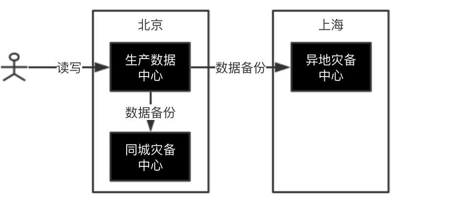
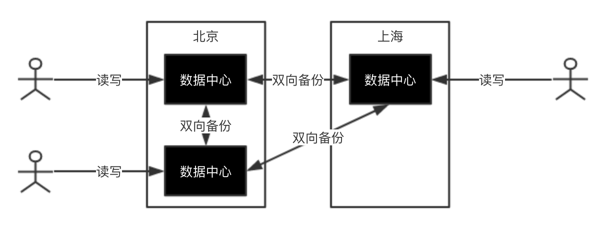
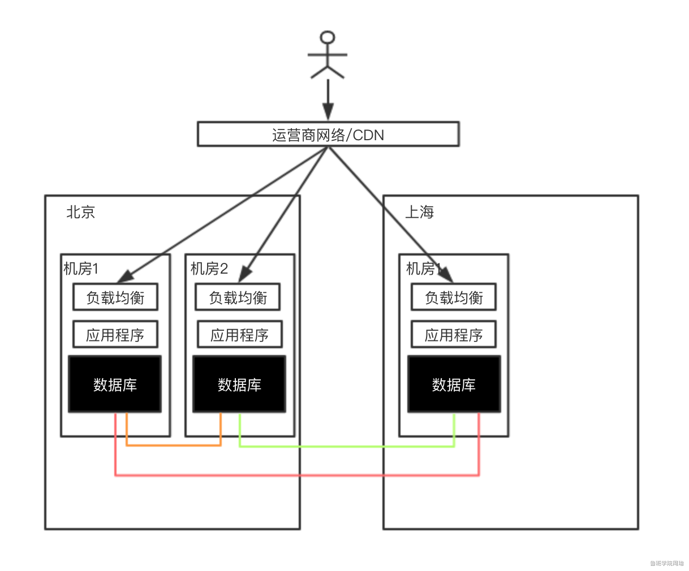
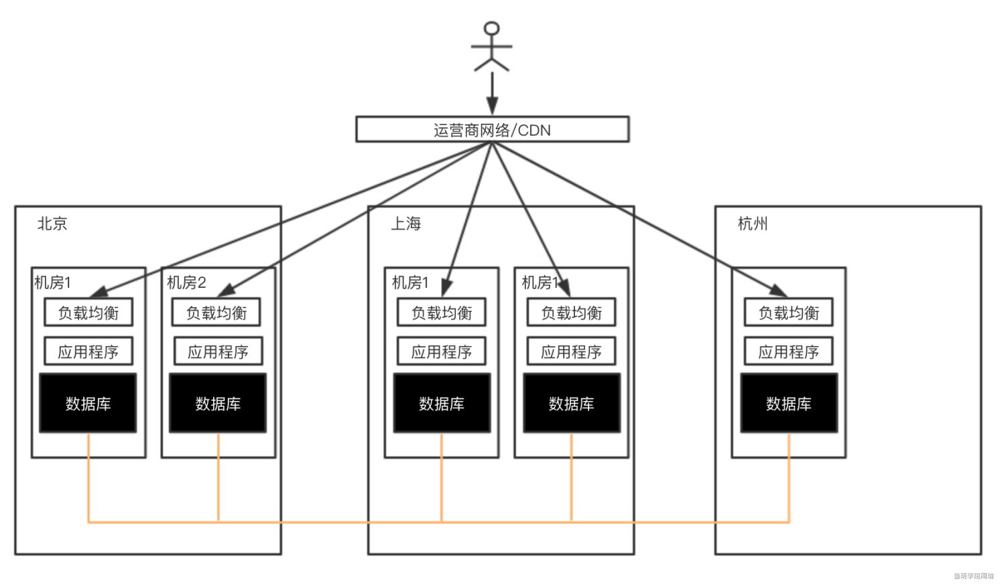

# 程序要一定要明白的架构-三地五中心（2）
作者：鲁班学院-讲师周瑜

[上篇文章](https://www.yuque.com/docs/share/d9d9ee83-bef6-4b8b-aa52-8959677ba3e5)我们总结了一下同城双活、异地多活、两地三中心等一些部署架构，那么这篇文章我来发表一下我对三**地五中心**的理解。
我们上篇文章讲过两地三中心这个架构，如下图：

这种架构具备容灾能力，比如生产数据中心停电了，那么可以把所有流量都切到同城灾备中心或异地灾备中心，那么现在的问题是假如真到了停电的那一天，**你敢把所有的流量都切到灾备中心去吗？**
**
上篇文章说了，**灾备中心它主要的功能是作为生产数据中心的一个备份，所以它并没有如同生产数据中心一样不停的在对外提供服务，**那么就有问题了，**灾备相当于一个新人，一个一直在模仿大哥的一个新人，现在大哥受伤了，按道理是应该小弟顶上，但是小弟还是个新人，硬顶上去是不是很有可能会出错？**也就是说：

- 第一，不能保证灾备中心有能力接管线上所有的用户流量，可能刚已接收灾备中心被压垮，或者出现其他各种各样预估不到的错误；
- 第二，如果生产数据中心接收了用户的写请求，还没来得及同步到灾备中心，这个时候停电了，这种情况下，也不能直接把用户流量切到灾备中心。

所以基于上面的分析，并不是说灾备中心一定不能顶上，只是在顶上之前可能还要做很多其他的检查和准备，这个时间是不确定的，至少不会很快...。

那么问题来了，该怎么办？

首先对于上面列出来的两点中的第一点，如果我们能够让灾备中心不再仅仅只能用来做灾备，还能和生产数据中心一样正常的对外提供服务呢？如下图：

可以看到上面的架构图：

- 不再区分生产数据中心和灾备数据中心，只有数据中心，而且数据中心之间相互备份数据，保证每个数据中心都是全量数据。
- 用户可以在任意一个数据中心上进行读写操作。

好，首先我们不管这种架构能不能实现，至少它的好处是非常明显的：

1. 每个数据中心一直在对外提供服务（不是一个新手），所以当一个数据中心停电后，直接把用户流量切到另外一个数据中心也是问题不大的。
1. 用户可以就近访问数据中心，这样用户的体验更好，并且整个架构的流量也比较平均。

优点很明显，如果能实现就再好不过了，那么这种架构实现起来最重要的一点就是：**用户同时向不同数据中心写入数据，数据中心双向同步数据时，如果出现冲突该如何解决？**
**
那么这个问题，目前阿里和蚂蚁金服的解决办法是：**将用户按某一个规则进行分组，每组用户写入数据时只能写入到指定的数据中心，相当于用户与数据中心绑定在一起了，这样保证了数据中心在双向同步之前数据是不会冲突的，因为按用户分组了，不同用户的数据不会冲突。**
**
当然思路非常简单，但是实现起来肯定是非常麻烦的，但是思路肯定是可以的，阿里也用实践证明了，我们先把上面的架构稍微完善一下：

用户使用网站时，由运营商网络或CDN选择最近的机房，机房内部署一个负载均衡，由这个负载均衡最终判断用户属于机房（前文中的数据中心），也就是可能出现，用户在注册时在北京，那么他的uid就和北京某个机房绑定了，那么当这个用户在上海使用时，会由上海的负载均衡按照**用户分组规则**将请求转发到北京绑定的那个机房去（当然并不是所有请求，比如读请求肯定可以直接在上海机房进行读取，所以具体的实现都要看业务怎么实现了，以及负载均衡具体的配置，这里只是把最简单易懂的思路说一下）。

所以，我们现在可以

- 假设北京机房1应用程序或数据库对应的机器停电了，那么我们可以调整负载均衡是原本属于这个机房的用户流量转移到机房2去，注意这里不要有疑问，将用户进行分组是为了防止用户同时写两个数据库发生冲突，那么现在机房1里其实已经不能写入数据了，所以将流量迁移到机房2是没有问题的。
- 假设北京机房1整个停电了，那么可以通过运营商网络或CDN将流量迁移到北京机房2。
- 假设北京停电了，那么一样可以将流量迁移到上海。

这个架构中最重要的其实就是**用户分组，**所以包括我们的应用程序、数据库负载均衡、数据库分表等等都需要按用户进行分组，我们要保证针对同一个用户的请求与操作都在同一个机房内，不去跨机房，这样才是最快的，这就是**单元化**。

那么上面这个架构实际上就是一个高级版的“两地三中心”，只是这种单元化架构我们可以任意去扩展（只要你足够有钱，因为搭一套全配置的数据中心是需要很高成本的），比如你在上海在增加一个数据中心，在杭州也增加一个，那么就如下图：

这就叫**三地五中心。**

市面上浅显的讲述三地五中心的文章不多，希望这篇文章能给你帮助，当然我也是参考了其他文章有了自己的理解，如果错误的地方欢迎大家指正**：**

- [https://www.infoq.cn/article/interview-alibaba-bixuan](https://www.infoq.cn/article/interview-alibaba-bixuan)
- [https://tech.antfin.com/community/articles/327](https://tech.antfin.com/community/articles/327)

> 相信大家不喜欢在小小的手机屏幕上还看到一大块的代码，阅读体验不好，所以我写作的风格会文字偏多一点。如果觉得有所收获就给个小小的赞吧。

